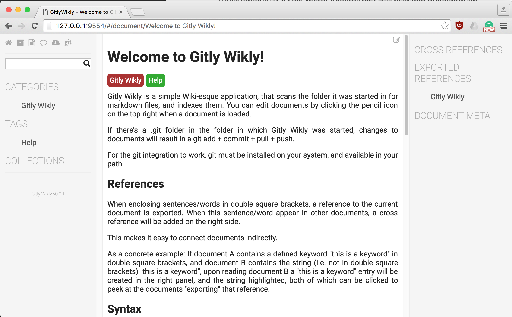

#gitly-wikly

**Turn your Git repository into a wiki**

## What

Gitly Wikly is a simple Wiki-esque application, that scans the folder it was started in for markdown files, and indexes them. You can edit documents by clicking the pencil icon on the top right when a document is loaded.

If there's a .git folder in the folder in which Gitly Wikly was started, changes to documents will result in a git add + commit + pull + push.

For the git integration to work, git must be installed on your system, and available in your path.

## Why

Gitly Wikly was written to be a lightweight collaborative wiki solution with the bare minimum of required features to be useful. The emphasis is on minimalism as well as "no backend required".

Specifically, it was written to sustain a collaborative world building and writing project in progress.

## Features

  * Auto commit+push when editing files contained in a git repository
  * Pull latest from the UI
  * Importing documents from URL's
  * Document meta information (title, categories, tags, etc.)
  * Markdown support
  * Cross-refrences: documents can export words/sentences as a reference, which will be automatically deduced in other documents when encountered
  * Automatically checks for origin changes (once a minute) and changes the color of the pull icon if there are any 
  * Works without git too, making it perfect for creating personal Wikis in your local file system, in your dropbox/gdrive/icloud and so on

## Planned Features
  
  * Collections: add documents to collections and order them. Collections can be exported as PDF's, LaTex, and epub
  * Distraction free editing

## Installing and Running

        
    npm install
    sudo npm link

Then open a terminal with markdown files in it, and run `gitly-wikly`.
Note that if there's no `index.md` in the root of the folder it's started in, one will be created.

## Demo

Run `gitly-wikly` in an empty folder, and navigate to `http://127.0.0.1:9554`.

## Known Issues

  * The back/forward buttons only work for documents
  * The search function is currently searching for single keywords only
  * There are some issues with the UI layout, namely that sometimes icons will overlap scrollbars

## License

[MIT](LICENSE). 